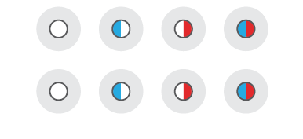
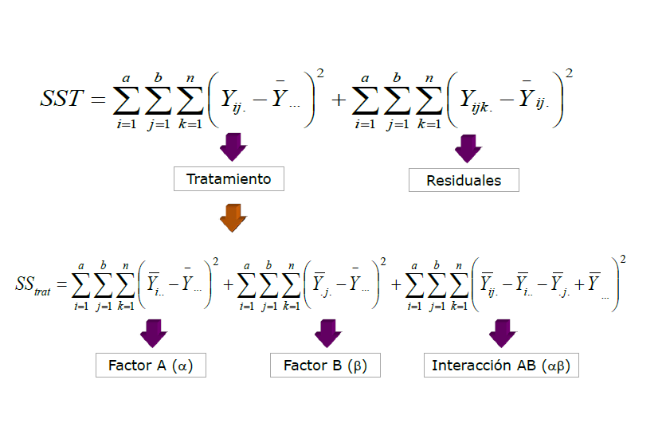
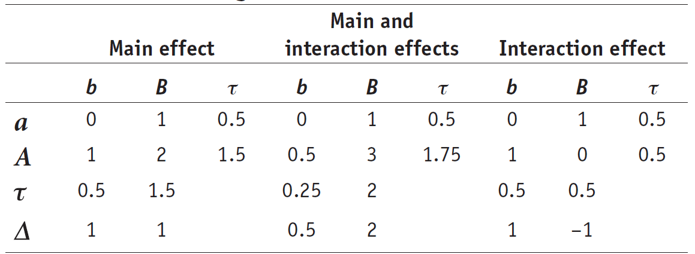
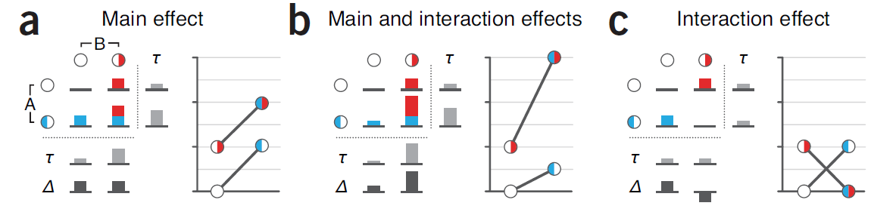

## ANOVA: Tabla ANOVA

  

|            |  Df|   Sum Sq| Mean Sq| F value| Pr(>F)|
|:-----------|---:|--------:|-------:|-------:|------:|
|Tratamiento |   3| 2256.167| 752.056| 782.267|      0|
|Residuals   | 796|  765.259|   0.961|      NA|     NA|

---

---&twocol

## ANOVA

*** =left

*** =right

 
 

|            | Df| Sum Sq| Mean Sq| F value| Pr(>F)|
|:-----------|--:|------:|-------:|-------:|------:|
|Tratamiento |  3| 59.444|  19.815|  20.089|      0|
|Residuals   | 16| 15.782|   0.986|      NA|     NA|

---

## Anova factorial: 2 x 2 

\[\underbrace{Y_{ij}}_{Respuesta} = \underbrace{\bar{\mu}}_{\text{Media global}} + \underbrace{\tau_i}_{\text{Efecto del factor 1}} + \underbrace{\beta_i}_{\text{Efecto del factor 2}}+  \underbrace{(\tau \beta)_{ij}}_{\text{Efecto de la interacción}}+\underbrace{e_{ij}}_{\text{Error aleatorio}} \]

--- 

## Anova factorial: 2 x 2 

--- 

## Partición de la Varianza 

\[ SS_{total}= SS_{\alpha}+ SS_{\beta}+ SS_{\alpha \beta}+SS_{error} \]

Siendo, 

+ $\alpha$: Factor 1 

+ $\beta$: Factor 2

+  $\alpha \beta $: Interacción

---

## Partición de la Varianza 

	
--- 

## Efectos a evaluar

---

## Efectos a evaluar

---

## Hipótesis

### Factor A 
+ 	\[H_0(A):\mu_1=\mu_2\]
	
### Factor B

+ 	\[H_0(B):\mu_1=\mu_2\]
	
### Interacción AB 

+ 	\[H_0(AB):(\alpha \beta)_{ij}=0\]

---
