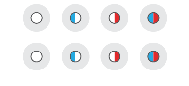
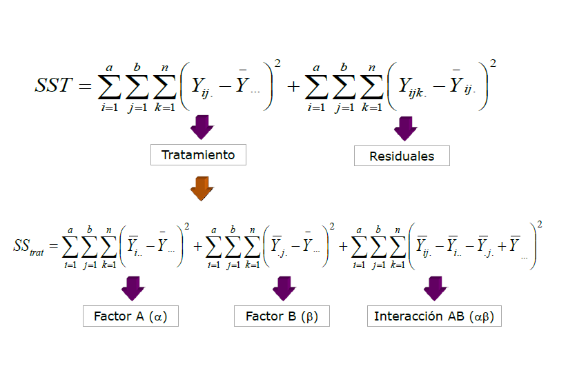
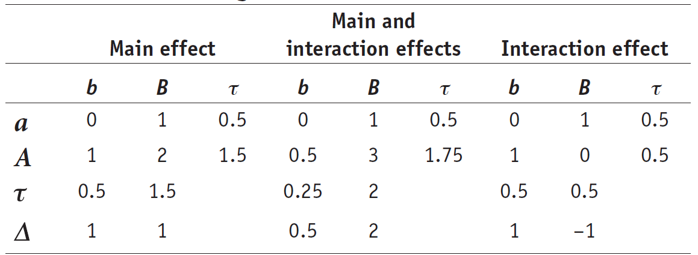
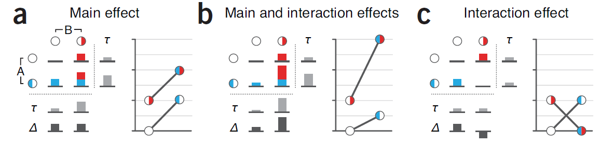

## ANOVA: Tabla ANOVA

  <span style="display:block; height: 4cm;"></span>
```{r, echo=FALSE,fig.align='center'}
library(xtable)
      wdata2 = data.frame(
  Tratamiento = factor(rep(c("Nada", "Hongos", 'Solarizada', 'Basamid'), each=200)),
  UFC = c(rnorm(200, 4), rnorm(200, 8), rnorm(200, 4), rnorm(200, 4)))

kable(anova(mod<-lm(UFC~Tratamiento, data=wdata2)), digits = 3)
```

---

---&twocol

## ANOVA

*** =left
```{r, echo=FALSE, message=FALSE, warning=FALSE}
library(ggplot2)
wdata4 = data.frame(
  Tratamiento = factor(rep(c("Nada", "Hongos", 'Solarizada', 'Basamid'), each=5)),
  UFC = c(rnorm(5, 4), rnorm(5, 7), rnorm(5, 4), rnorm(5, 2)))


wdata4$Tratamiento<-factor(wdata4$Tratamiento, levels = c('Nada','Hongos','Basamid','Solarizada'))

ggplot(wdata4, aes(Tratamiento, UFC)) + 
  geom_boxplot(aes(fill = Tratamiento))  + 
  geom_jitter(position = position_jitter(width = .15), alpha=0.3, size=2) +
  xlab("Tratamiento") +
  ylab("Log(UFC/g)") +theme_bw() + theme(legend.position = "none",axis.title.x=element_text(size = 22), 
                                     axis.title.y = element_text(size = 22))


```

*** =right

 <span style="display:block; height: 4cm;"></span>
 
```{r, echo=FALSE, message=FALSE}
kable(anova(mod<-lm(UFC~Tratamiento, data=wdata4)), digits = 3)
```


---

## Anova factorial: 2 x 2 

\[\underbrace{Y_{ij}}_{Respuesta} = \underbrace{\bar{\mu}}_{\text{Media global}} + \underbrace{\tau_i}_{\text{Efecto del factor 1}} + \underbrace{\beta_i}_{\text{Efecto del factor 2}}+  \underbrace{(\tau \beta)_{ij}}_{\text{Efecto de la interacción}}+\underbrace{e_{ij}}_{\text{Error aleatorio}} \]

--- 

## Anova factorial: 2 x 2 


```{r, echo=FALSE,fig.align='center'}
      
```

--- 


## Partición de la Varianza 

\[ SS_{total}= SS_{\alpha}+ SS_{\beta}+ SS_{\alpha \beta}+SS_{error} \]

Siendo, 

+ $\alpha$: Factor 1 

+ $\beta$: Factor 2

+  $\alpha \beta $: Interacción


---


## Partición de la Varianza 

```{r, echo=FALSE,fig.align='center'}
      
```
	
--- 


## Efectos a evaluar

```{r, echo=FALSE,fig.align='center'}
      
```

---

## Efectos a evaluar

```{r, echo=FALSE,fig.align='center'}
      
```

---

## Hipótesis


### Factor A 
+ 	\[H_0(A):\mu_1=\mu_2\]
	
### Factor B

+ 	\[H_0(B):\mu_1=\mu_2\]
	
### Interacción AB 

+ 	\[H_0(AB):(\alpha \beta)_{ij}=0\]

---


