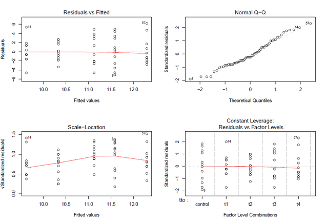
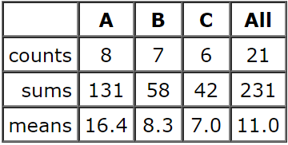

## Supuestos ANOVA


```{r, echo=FALSE, message=FALSE, warning=FALSE, fig.align='center'}
library(ggpubr)
wdata3 = data.frame(
  Tratamiento = factor(rep(c("Nada", "Hongos", 'Solarizada', 'Basamid'), each=200)),
  UFC = c(rnorm(200, 4), rnorm(200, 4), rnorm(200, 4), rnorm(200, 4)))


gghistogram(wdata3, x = "UFC",
            add = "mean", rug = TRUE,
            fill = "Tratamiento",
            add_density = TRUE, xlab = 'UFC/g', ylab = 'Frecuencia')
```


--- .class #id 

## Supuestos ANOVA


```{r, echo=FALSE, message=FALSE, warning=FALSE, fig.align='center'}

```

---

## ¿Y qué pasa si fallan.... ?

```{r, echo=FALSE,fig.align='center'}
      
```

---

## Prueba de Kruskal - Wallis 

 + Método no paramétrico que permite comparar, en un solo test, los __rangos medios__ de un conjunto de k muestras independientes.
 
 + Análogo a la ANOVA de una vía 
 
 + Útil cunado no se cumplen supuestos de normalidad y homogeneidad de varianzas

  + Una buena opción cuando se tiene muestra pequeña

---

## ¿ Cómo funciona ? 

```{r, echo=FALSE,fig.align='center'}
      knitr::include_graphics('./assets/img/tabla1.png')
```

---

## ¿ Cómo funciona ? 

```{r, echo=FALSE,fig.align='center'}
      knitr::include_graphics('./assets/img/tabla2.png')
```

---

## ¿ Cómo funciona ? 

```{r, echo=FALSE,fig.align='center'}
      
```

\[SS_{factor} =\sum  \Big[ n_g(Med_g - Med_{total})^2 \Big]\]

---

## Kruskal - Wallis estadístico _H_

\[H=\frac{SS_{factor}}{N(N+1)/12}\]

---


