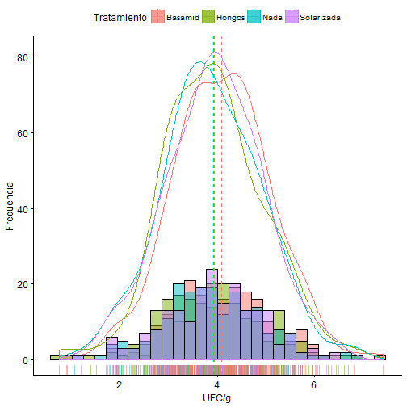
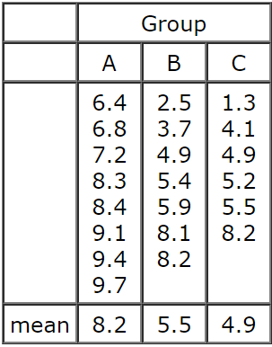
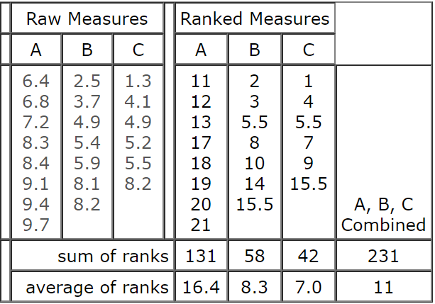
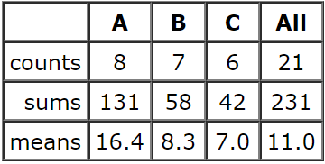

## Supuestos ANOVA

--- .class #id 

## Supuestos ANOVA

---

## ¿Y qué pasa si fallan.... ?

---

## Prueba de Kruskal - Wallis 

 + Método no paramétrico que permite comparar, en un solo test, las __medianas__ de un conjunto de k muestras independientes.
 
 + Análogo a la ANOVA de una vía 
 
 + Útil cunado no se cumplen supuestos de normalidad y homogeneidad de varianzas

  + Una buena opción cuando se tiene muestra pequeña

---

## ¿ Cómo funciona ? 

---

## ¿ Cómo funciona ? 

---

## ¿ Cómo funciona ? 

\[SS_{factor} =\sum  \Big[ n_g(Med_g - Med_{total})^2 \Big]\]

---

## Kruskal - Wallis estadístico _H_

\[H=\frac{SS_{factor}}{N(N+1)/12}\]

---

